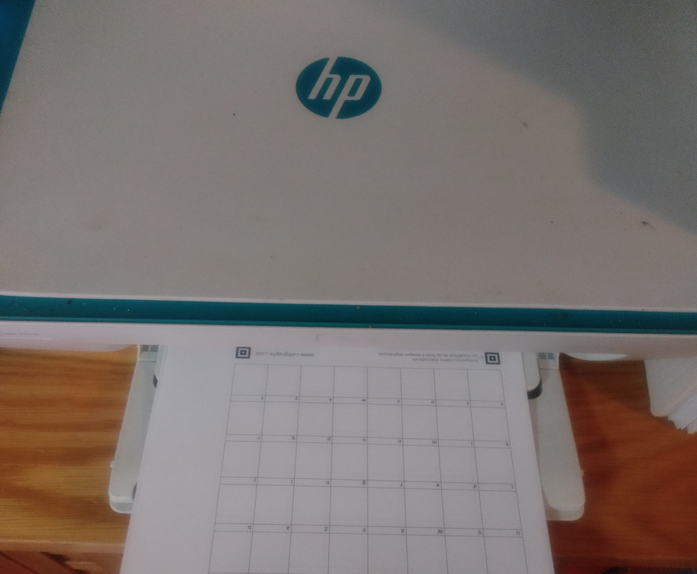

 
Esta entrada del blog es distinta, esto que están leyendo es mi propia fuente,
eso significa que las tipografía que están viendo, es la forma física en la que yo
escribo, es bastante sorprendente.
  
En este tutorial les enseñaré a lograr esto, crear una tipografía digital con su
propia letra, así que comencemos.
  

#### 1. Crea una cuenta en [Calligraphr](https://www.calligraphr.com/)

El primer paso es crear una cuenta en [Calligraphr](https://www.calligraphr.com/), ingresa tu correo
y la contraseña para tu cuenta, verifica tu correo y una vez que hayas hecho eso, inicia sesión.

#### 2. Crea una nueva aplicación
El siguiente paso es crear una nueva aplicación, debes presionar el siguiente botón.

#### 3. Debes de descargar la plantilla
Descargar la plantilla es muy importante, ya que es la hoja que debemos imprimir para posteriormente,
rellenar con nuestra letra.

#### 4. Escoge idioma y dale en descargar
Primero escoge el idioma español y después escoge la opción de descargar.

#### 5. Imprime la plantilla descargada
Imprime la plantilla en una hoja blanca tamaño carta.

#### 6. Rellena la plantilla impresa
Aquí hay varios puntos importantes a resaltar:
* Usa un lápiz para poder borrar.
* Tienes que ser lo más natural que puedas, una letra demasiado perfecta no tiene sentido.
* Trata de que el tamaño de las letras sea proporcional entre ellas, eso significa que 
por ejemplo una coma (,) proporcionalmente más pequeña que la letra A
* No te mortifiques si se te fue un rayón de más, si hiciste una letra más arriba que otra,
o si salió más grande, eso se puede editar después y no habrá problema.

Así que ponte a llenar la hoja dada, en la parte superior dice que letra o símbolo debes dibujar.

#### 7. Escanea la hoja rellenada
Es un paso simple, tienes que escanear la hoja, si no tienes escáner, tómale una foto a la hoja,
trata de que se vea lo mejor posible.

#### 8. Sube el documento escaneado a la página
En en el botón de cargar plantilla, entra y luego selecciona tus plantillas llenas digitalizadas, 
por último, da click en cargar plantilla.

Después de eso, agrega los caracteres y tendrás digitalizada tu letra, aunque aún falta un último paso.

#### 9. Soluciona los errores de formato
En los tres puntos a la derecha, entra y presiona ajustar linea base.

Ahí ajusta tu letra, debes ajustar que tenga el tamaño correcto, proporcionalmente a las otras letras y
que esté ajustada a como debe ser cada letra.

#### 10. Descarga la fuente

Ya que haz dejado a la perfección tu fuente personalizada, ahora debes descargarla para usarla en donde tu quieras.
Para descargarla haz click en el botón "Generar Fuente" y luego Generar, te saldrá la siguiente pantalla.

Ahí podrás ver como se ve ya junta en un texto aleatorio, si no te convence ve al paso 9 y soluciona los defectos,
si estás satisfecho con ella haz click en el archivo .otf, es un archivo de typografía para importarla donde desees.

#### 11. Usa tu fuente
Usa y disfruta tu fuente, usa el archivo .otf donde lo desees.

 
Espero que les haya servido y puedan hacer cosas interesantes con su tipografía personal,
ya que hay cosas interesantes de hacer y tu letra escrita por una computadora es impresionante.
  
Les mando un saludo.

